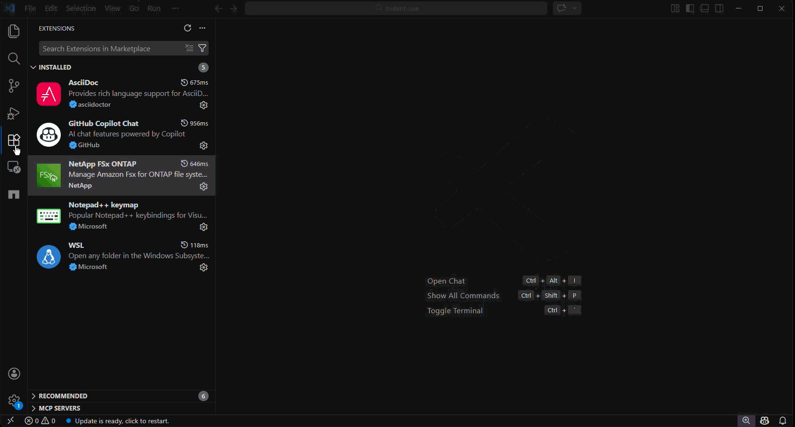
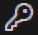
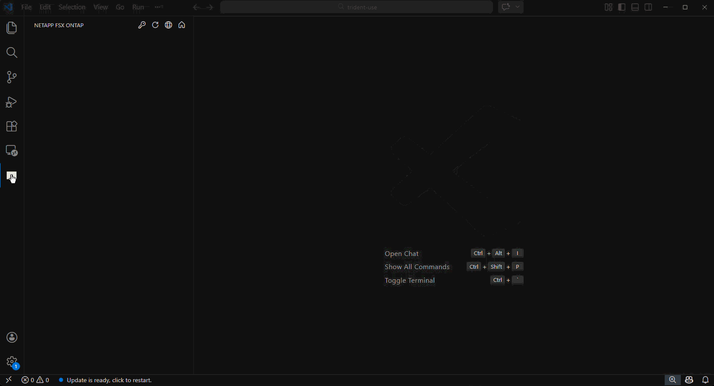

# FSx for Netapp ONTAP VS Code Extension
------
## AI-Powered Storage Management 
Access FSx for ONTAP storage management capabilities directly from VS Code. Manage storage resources, generate templates and perform AI-powered natural language queries directly from VS Code.

## Key Features
### Core Functionality
* Resource Management: Browse and manage FSx file systems, SVMs and volumes.
* Single-click ONTAP CLI access: Open ONTAP CLI in a single click using the VS Code terminal.
* One-Click Operations: Create SVMs, Volumes and snapshots, generate mount scripts and deploy templates.
* View the content of the files in your volumes.
### AI-Powered Chat Integration
* @fsx-ontap Chat Participant: Leverage Bedrock or GitHub Co-pilot to query your AWS FSx for ONTAP storage resources.
* @fsx-ontap /filesystem : Use natural language to query ONTAP (FSx for ONTAP OS), with no need for prior ONTAP knowledge.
* Template Generation: Leverage @fsx-ontap chat participant to create contextualized CloudFormation, Terraform, Ansible and Bash templates.
* Intelligent Recommendations: AI-powered analysis and optimization suggestions
* Context-Aware Assistance: Framework-specific code generation and best practices
### Prerequisites
* VS Code: Version 1.105.0 or higher
* AWS Account: With access to AWS FSx for ONTAP
* GitHub Copilot: For AI-powered chat features (optional but recommended)
* Amazon Bedrock: For AI-powered chat features (optional but recommended)
* S3 Access Point: For viewing the contents of your volumes (optional)
## Getting Started
1. Open the FSx for ONTAP toolkit extension

2. Use the credentials 
button choose the AWS credential profile you'd like to work with.

3. Click on the globe icon to select the regions you want to work within.

-----
## FSx for ONTAP Configuration and Management

### Manage FSx resources across multiple AWS regions
Using the extension you'll be able to view all of your FSx for ONTAP File Systems, SVMs and volumes
across all the selected AWS regions.

### View the contents of your volumes
Once you have configured a [S3 Access Point](https://docs.netapp.com/us-en/workload-fsx-ontap/manage-s3-access-points.html)
for a volume, you can view the contents of that volume by first expanding the volume to reveal the Access Point, then
expanding Access Point to reveal all the files within the volume. Simply click on a file to see the contents:

### SSH to ONTAP
You can easily SSH into the file system without having to memorize IP addresses or file system hostnames.
Just click on the "shell" icon and the extension will prompt you for the username and connection method. You can connect
either directly, if your PC has network connectivity to the file system, or via an EC2 Instance Connect Endpoint. If you
choose EC2 Instance Connect, it will prompt you for the EC2 Instance Connect endpoint ID. Once you provide these items
it will bring up a terminal with ssh connecting to your file system. The ssh application will prompt you for your password
before logging you in.
If desired, the extension can securely store the connection information in a ExtensionContext Secret Storage object,
that is encrypted and not synchronized across platforms. Once you have done that, it is a single click to
bring up the 'ssh' session to your file systems. You store the connection information by clicking on the
person icon and providing the pertinent information. At that point you'll noticed the "cloud" icon in front of the system
turns into a solid circle with a check mark, indicating it has stored the connection information. You'll also
noticed that the person icon has gone away. If you need to update the connection information, just right click on the file
system name and select "Configure ONTAP connection details." Note the extension will prompt you for the password,
although that will not be used for the 'ssh' connection, only when performing things that can't be done via
the AWS API, like creating snapshots.

### Creating SVMs, volumes and snapshots
#### Create an SVM
To create an SVM (Storage Virtual Machine), simply click on the "+" to the right of the file system name.
The extension will prompt you for the name to assign to the SVM.

#### Create a volume
To create a volume, simply click on the "+" to the right of the SVM. The extension will prompt you for the
volume name and size.

#### Create a Snapshot
To create an ONTAP snapshot of a volume, click on the camera icon to the right of the volume. Note that since
this requires issues an ONTAP API against the file system, it will need credentials to do so. If you have stored
your connection information like mentioned above, it will use those parameters, otherwise will will prompt you for the
information it needs to issue the API.

### Creating templates
* To generate a template that will provision an SVM, right click on the file system name where you want the SVM reside under and select the type of template you want to create.
* To generate a template that will provision a volume, right click on the SVM where you want the volume to reside and select the type of template you want to create.
## FSx for ONTAP chatbot participant
### Examples of use
Use `@fsx-ontap` in chatbot input box to invoke the NetApp chat participant, where you can ask
questions about your FSx for ONTAP resources and get a NetApp ONTAP expert advice. Here are a few examples:

If you provide a `/filesystem` argument the chatbot will leverage native ONTAP commands to obtain the required information.
This allows you query things that aren't available via the AWS console. For example FlexClone information.

### Configuration
By default, the Chatbot will use AWS's Bedrock from the us-east-1 region. To change it to use another region,
click on the setting within the NetApp extension and change the "Bedrock region" setting:

**Note**: If you want to use GitHub's co-pilot as your AI framework, set the Bedrock region to an empty string.
### Final Thoughts
NetApp Chat participant AI analysis and responses should be verified and considered for your specific
 requirements before implementing any recommendations.

To see a full list of features, visit our [documentation](https://docs.aws.amazon.com/toolkit-for-vscode/latest/userguide/working-with-aws.html).

Submit bug reports and feature requests on our [Github repository](https://github.com/NetApp/fsx-ontap-vscode).

[EULA](https://github.com/NetApp/fsx-ontap-vscode/blob/main/eula.txt)